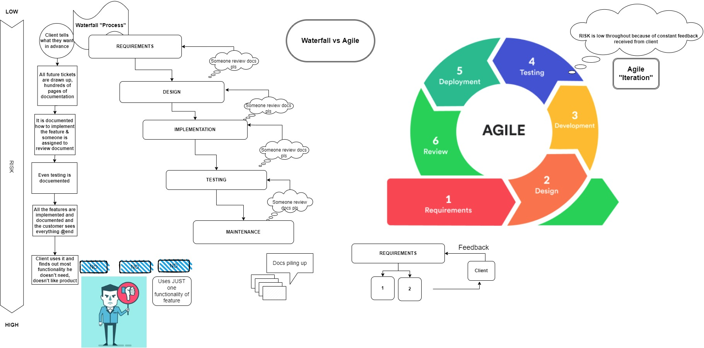

# **Agile Manifesto**

### The 4 Values
___
> ### 1. Individuals and interactions over processes and tools
>Competent people should drive the development process and not tools.
> 
>Allow people to take ownership and to contribute with their unique value (e.g their energy, innovation, ability to solve problems) to the software. Teamwork and communication becomes strong as people work together.

> ### 2. Working software over comprehensive documentation
>Build basic software (key skeleton software that is working) and get client feedback quickly rather than writing a book about every little detail and deliver it in a year.
>
> The value comes from the quick software feedback (not documentation feedback) received from the client by USING this skeleton software. Build it to use it! 
The client, only after using the software, finds out what they need and then further development should be carried out based on their input.

> ### 3. Customer collaboration over contract negotiation
>The client's review is built into the process and the client gets to see the product at the end of every sprint as opposed to the "waterfall process" where the client was only involved at the beggining and at end of the process.
> 
>The client then can steer the project by proving input to the developer.This increases client satisfaction by handling change effectively.

> ### 4. Responding to change over following a plan
>Start with the direction you want to move into and then proceed to see new events unfolding and incorporate them into ongoing work. New events are not to be seen as obstacles but instead as opportunities to provide additional value.
> 
>Not only to respond to change but to  welcome change (add, remove, reprioritize or even chuck away the whole product backlog) and shorten sprints (1 week -continuous integration) to accomodate change.
____

### The 12 Principles
> #### _1. Our highest priority is to satisfy the customer through early and continuous delivery of valuable software._
> Create a gameplan and timeline and then get a team aligned to the top priority is the best way of achieving the goal
> 
>Constructive conflict is used toward a shared goal. Start working on items in priority order`
>
>What is the most important feature/item on the list? Create the minimal most important feature and go back to client for feedback.

 

> #### _2. Welcome changing requirements, even late in development. Agile processes harness change for the customer's competitive advantage._
>Changes should be seen as a possibility and not as another way to delay and overcomplicate the project.
> 
>It doesn't matter how far along developers are in their process the cost/risk is still low to client as per constant feedback cycle.

 

> #### _3. Deliver working software frequently, from a couple of weeks to a couple of months, with a preference to the shorter timescale._
>Get requirements > prioritise requirements > deliver in priority order as soon as you can.
> 
>Work towards several releases a day for software. By receiving constant feedback the risk is low for the customer not to use the software.

 

> #### _4. Business people and developers must work together daily throughout the project._
>By putting them together on a daily basis they get used to each other and they develop a common understanding of the goal of the project. Through Standups, Kick offs, retros developers have access to PMs and BAs

 

> #### _5. Build projects around motivated individuals. Give them the environment and support they need, and trust them to get the job done._
>Eliminate micromanagement, trust the team to self-organise and empower the motivated team members in their solutions.

 

> #### _6. The most efficient and effective method of conveying information to and within a development team is face-to-face conversation._
 >Enhance communication with people and minimise writing documentation in their absence.

 

> #### _7. Working software is the primary measure of progress._
>Working software is Released software. You measure progress when you deliver software.Don't fuss over items in QA.
> 
>It doesn't matter how many working hours you've invested in your project, how many bugs you managed to fix, or how many lines of code your team has written.If the result of your work is not the way your customer expects it to be, you are in trouble

 

> #### _8. Agile processes promote sustainable development.The sponsors, developers, and users should be able to maintain a constant pace indefinitely._ 
>As agile processes promote sustainable development, the sponsors, the users ,developers should be able to maintain a constant pace indefinitely. 
> 
>The goal is to avoid overburden and optimize the way you work so you can frequently deliver to the market and respond to change without requiring personal heroics from your team.
>
>Pressure slips,bad habits, shortcuts, non-pairing, non-mobbing makes the code unsustainable because people feel under pressure to deliver software quickly. They should not feel against the clock and they should not feel like they have to drop other things. It's about doing the right thing all the time! 
> 
>Coders shouldn't sacrifice code quality if they feel under pressure instead need to find a pace that would work for them even if it means delivering the product later than expected. People can use the Honesty Agile principle - if people are not going to hit the target what is going to happen?
> 
 

> #### _9. Continuous attention to technical excellence and good design enhances agility._
>Create adaptive, simple and flexible code that's designed in a way that it's easy to change with requirements.Think about how to structure code (use SOLID). If the code is designed properly next time you implement a feature and revisit the code it will be easy to add a new feature that builds on top of existing code.
>
 

> #### _10. Simplicity -- the art of maximizing the amount of work not done -- is essential._
>Stick to the requirements and only implement what you need.  Don't think about what you need to do in the future and don't speculate on the code required.
> 
>Write the minimum amount of code required, still high standard code and still following the SOLID principles. By building code in this way we get quick feedback from client and we are maximise the things we won't do.Work on small tickets (quick iterations) and one at a time.

 

> #### _11. The best architectures, requirements, and designs emerge from self-organizing teams._
>Work with capable people who specialise in their fields (FE, BE, Testing, UX) and who are motivated to get the work done. Basically, let them work out how to proceed the work they want to pick up. Don't impose restrictions in terms of their specific roles as well, let them give opinions about other specialities, eg BackEnd getting involved in BA work.

 

> #### _12. At regular intervals, the team reflects on how to become more effective, then tunes and adjusts its behavior accordingly._
>Incorporate retros, BackEnd Chats and add time in the calendar for teams improvements at regular intervals. The team performs at its best when the individuals feel comfortable within the team therefore a good idea is to also add some team building exercises.

___